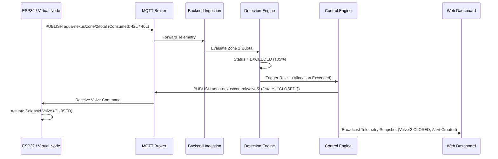

# AQUA-NEXUS System Architecture

AQUA-NEXUS is an IoT-enabled cyber-physical water management and telemetry platform designed for municipal campuses, commercial complexes, and modern residential communities.

---

## 1. High-Level Cyber-Physical Topology

```mermaid
graph TD
    subgraph "Edge / Physical Layer (ESP32 or Simulator)"
        S_Main[YF-S201 Main Inflow Meter] --> ESP_Main[ESP32 Node 1: Reservoir]
        S_Tank[HC-SR04 Ultrasonic Sensor] --> ESP_Main
        A_Pump[Main Booster Pump Relay] <-- ESP_Main
        
        S_Z1[YF-S201 Zone 1 Meter] --> ESP_Z12[ESP32 Node 2: Multi-Zone]
        S_Z2[YF-S201 Zone 2 Meter] --> ESP_Z12
        A_V1[Solenoid Valve Zone 1] <-- ESP_Z12
        A_V2[Solenoid Valve Zone 2] <-- ESP_Z12
        
        S_Z3[YF-S201 Zone 3 Meter] --> ESP_Z3[ESP32 Node 3: Irrigation]
        A_V3[Solenoid Valve Zone 3] <-- ESP_Z3
    end

    subgraph "Messaging Bus"
        ESP_Main -->|MQTT QoS 0/1| Broker[Mosquitto MQTT Broker :1883]
        ESP_Z12 -->|MQTT QoS 0/1| Broker
        ESP_Z3 -->|MQTT QoS 0/1| Broker
        Broker -->|MQTT Commands| ESP_Main
        Broker -->|MQTT Commands| ESP_Z12
        Broker -->|MQTT Commands| ESP_Z3
    end

    subgraph "Backend Engine (FastAPI :8000)"
        Broker <-->|Paho-MQTT| BackendWorker[Telemetry Ingestion Service]
        BackendWorker --> DetectionEngine[Water Accountability & Detection Engine]
        BackendWorker --> ControlEngine[Automated Interlock & Control Engine]
        DetectionEngine --> ORM[SQLAlchemy 2.0 ORM]
        ControlEngine --> ORM
        ORM <--> DB[(SQLite / PostgreSQL)]
        
        AuthService[PBKDF2 / HMAC Auth & RBAC] --> REST_API
        REST_API[FastAPI REST Router] <--> ORM
        WS_Server[WebSocket Server :8000/api/ws/telemetry] <--> BackendWorker
    end

    subgraph "Presentation Layer (React + Vite :5173)"
        AdminPortal[Admin / Facility Manager Portal] <-->|HTTP / REST + WS| REST_API
        ZonePortal[Zone User / Resident Portal] <-->|HTTP / REST + WS| REST_API
        DemoDeck[Demo Scenario Controller] -->|REST POST| REST_API
    end
```

---

## 2. Role-Based Multi-User Architecture

AQUA-NEXUS enforces strict server-side cryptographic isolation across two operational tiers:

```
                            AQUA-NEXUS
                                 │
                 ┌───────────────┴───────────────┐
                 │                               │
            ADMIN ROLE                     ZONE_USER ROLE
                 │                               │
        Full Facility Scope             Assigned Zone Scope
        - Central Reservoir             - Ingress Water Received
        - Booster Pump & Valves         - Fixture Water Consumed
        - All Zones (1, 2, 3)           - Zone Difference Ledger
        - Dynamic Allocations           - Remaining Quota Gauge
        - User Administration           - Instantaneous Flow Stream
        - Scenario Simulator            - No Actuator Controls
```

### Server-Side Isolation Guarantee
All user-facing endpoints derive the sector identity from the authenticated cryptographically signed bearer token (`current_user.zone_id`). Parameter spoofing (e.g. attempting to request `/api/user/zone/1` while assigned to Zone 2) is intercepted by backend dependencies and immediately rejected with `HTTP 403 Forbidden`.

---

## 3. Two-Tier Water Accountability Model

1. **Facility-Level Transmission Accountability**:
   $$V_{\text{facility\_unaccounted}} = V_{\text{total\_incoming}} - \sum_{i=1}^{N} V_{\text{zone\_received}, i}$$
   Captures physical loss along main transmission pipelines (pipe bursts, trunk joint leakage).

2. **Zone-Level Consumption Accountability**:
   $$V_{\text{zone\_difference}, i} = V_{\text{zone\_received}, i} - V_{\text{zone\_consumed}, i}$$
   Captures physical loss and meter variance within sector branch lines and residential fixtures.

---

## 4. Automated Feedback & Closed-Loop Control



---

## 5. Technology Stack Justification

| Layer | Chosen Technology | Technical Justification |
|---|---|---|
| **Backend Framework** | FastAPI (Python 3.13) | Asynchronous non-blocking architecture, native WebSocket support, Pydantic type safety, and automatic OpenAPI schema generation. |
| **Authentication & RBAC** | PBKDF2 + HMAC-SHA256 | Zero-dependency, secure standard library cryptography for robust identity and sector authorization. |
| **Database ORM** | SQLAlchemy 2.0 | Clean separation of business logic from raw SQL; supports async/sync operation and migration from SQLite to enterprise PostgreSQL. |
| **Messaging Protocol** | MQTT v3.1.1 (Mosquitto) | Standard lightweight pub/sub protocol designed specifically for microcontrollers with minimal packet overhead (2-byte header). |
| **Frontend Framework** | React 19 + Vite | Fast hot module replacement (HMR), component-driven reactive state, and sub-second bundle builds. |
| **Styling** | Vanilla CSS Design System | Maximum aesthetic control, zero build-step bloat, pure hardware-accelerated CSS variables and animations. |
