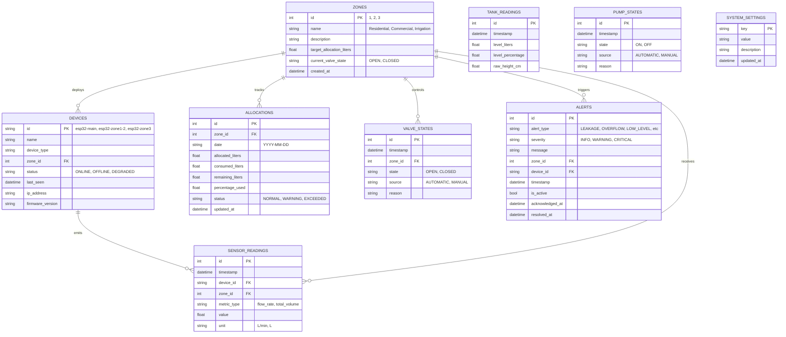

# AQUA-NEXUS Database Schema & Storage Architecture

AQUA-NEXUS utilizes a normalized relational database schema designed to support both high-frequency IoT time-series telemetry and relational entity relationships (zones, devices, allocations, and incident audit trails).

---

## 1. Entity-Relationship Diagram

---

## 2. Table Specifications

### 2.1 `devices`
Tracks physical and simulated microcontroller hardware nodes.
| Column | Type | Constraints | Description |
|---|---|---|---|
| `id` | VARCHAR(50) | PRIMARY KEY | Unique hardware node identifier (e.g. `esp32-main`) |
| `name` | VARCHAR(100) | NOT NULL | Human-readable node descriptor |
| `device_type` | VARCHAR(50) | NOT NULL, DEFAULT 'ESP32' | Microcontroller category |
| `zone_id` | INTEGER | FOREIGN KEY (`zones.id`), NULLABLE | Physical zone assignment |
| `status` | VARCHAR(20) | NOT NULL, DEFAULT 'ONLINE' | Heartbeat status (`ONLINE`, `OFFLINE`) |
| `last_seen` | DATETIME | NULLABLE | Timestamp of last received message |
| `ip_address` | VARCHAR(50) | NULLABLE | Local DHCP / static IP address |
| `firmware_version` | VARCHAR(20) | NULLABLE | Active embedded firmware release |

### 2.2 `zones`
Represents physical water distribution subdivisions.
| Column | Type | Constraints | Description |
|---|---|---|---|
| `id` | INTEGER | PRIMARY KEY | Zone index (1, 2, 3) |
| `name` | VARCHAR(100) | NOT NULL | Name (e.g. `Zone 1: Residential Block A`) |
| `description` | VARCHAR(255) | NULLABLE | Occupancy or purpose details |
| `target_allocation_liters` | FLOAT | NOT NULL, DEFAULT 50.0 | Daily baseline quota budget |
| `current_valve_state` | VARCHAR(20) | NOT NULL, DEFAULT 'OPEN' | Solenoid valve position (`OPEN`, `CLOSED`) |
| `created_at` | DATETIME | DEFAULT utc_now | Creation timestamp |

### 2.3 `sensor_readings`
High-resolution time-series sensor observations.
| Column | Type | Constraints | Description |
|---|---|---|---|
| `id` | INTEGER | PRIMARY KEY, AUTOINCREMENT | Unique reading ID |
| `timestamp` | DATETIME | NOT NULL, INDEXED | Reading capture time (UTC) |
| `device_id` | VARCHAR(50) | NOT NULL, INDEXED | Source node ID |
| `zone_id` | INTEGER | NULLABLE, INDEXED | Target zone (NULL for main supply) |
| `metric_type` | VARCHAR(50) | NOT NULL, INDEXED | `flow_rate` (L/min) or `total_volume` (L) |
| `value` | FLOAT | NOT NULL | Measured physical quantity |
| `unit` | VARCHAR(20) | NOT NULL | Measurement unit |

### 2.4 `tank_readings`
Primary water storage reservoir telemetry.
| Column | Type | Constraints | Description |
|---|---|---|---|
| `id` | INTEGER | PRIMARY KEY, AUTOINCREMENT | Unique reading ID |
| `timestamp` | DATETIME | NOT NULL, INDEXED | Time of observation |
| `level_liters` | FLOAT | NOT NULL | Computed current water volume (liters) |
| `level_percentage` | FLOAT | NOT NULL | Level as a fraction of capacity (0–100%) |
| `raw_height_cm` | FLOAT | NULLABLE | Raw ultrasonic time-of-flight distance |

### 2.5 `allocations`
Daily quota budgets and usage accounting.
| Column | Type | Constraints | Description |
|---|---|---|---|
| `id` | INTEGER | PRIMARY KEY, AUTOINCREMENT | Record ID |
| `zone_id` | INTEGER | FOREIGN KEY (`zones.id`), NOT NULL | Monitored zone |
| `date` | VARCHAR(10) | NOT NULL, INDEXED | Target date (`YYYY-MM-DD`) |
| `allocated_liters` | FLOAT | NOT NULL | Permitted water volume |
| `consumed_liters` | FLOAT | NOT NULL, DEFAULT 0.0 | Cumulative volume consumed |
| `remaining_liters` | FLOAT | NOT NULL | Allowance balance |
| `percentage_used` | FLOAT | NOT NULL | Consumption ratio percentage |
| `status` | VARCHAR(20) | NOT NULL | `NORMAL`, `WARNING`, `EXCEEDED` |

---

## 3. Indexing Strategy
To ensure sub-millisecond query performance on live dashboards:
1. `idx_sensor_time_metric`: Composite index on `(timestamp, metric_type, zone_id)` optimizes 24-hour historical aggregations.
2. `idx_allocation_zone_date`: Unique index on `(zone_id, date)` guarantees idempotency of daily quota updates.
3. `idx_alert_active_sev`: Composite index on `(is_active, severity)` accelerates active alarm polling.
